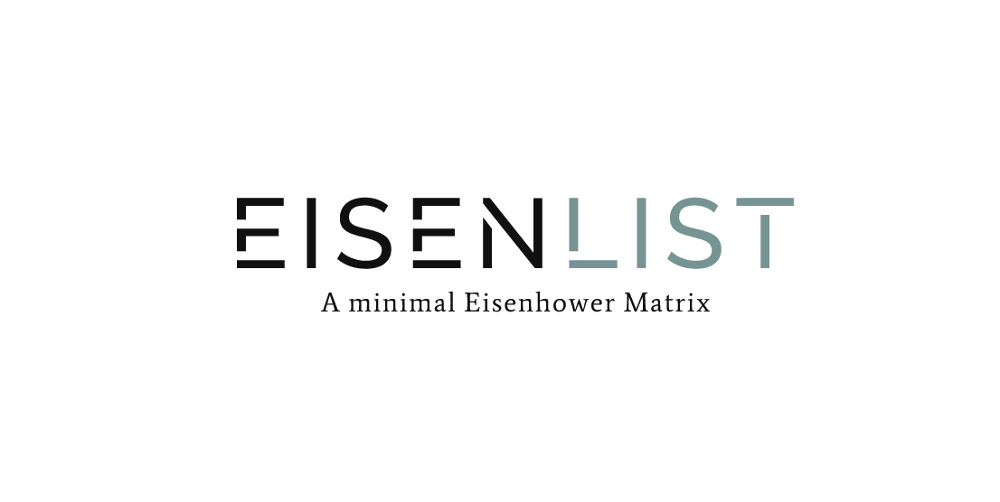

[![Contributors][contributors-shield]][contributors-url]
[![Forks][forks-shield]][forks-url]
[![Stargazers][stars-shield]][stars-url]
[![Issues][issues-shield]][issues-url]
[![MIT License][license-shield]][license-url]
[![LinkedIn][linkedin-shield]][linkedin-url]


<!-- PROJECT LOGO -->
<br />
<p align="center">
  <a href="https://eisenlist.web.app">
    
  </a>

  <!-- <h3 align="center">EisenList</h3> -->

  <p align="center">
    A minimal EisenHower Matrix, made to GET-SHIT-DONE (only!)
    <br />
    <br />
    <a href="https://eisenlist.web.app">View Demo</a>
    ·
    <a href="https://github.com/adityaketkar/eisenlist/issues">Report Bug</a>
    ·
    <a href="https://github.com/adityaketkar/eisenlist/issues">Request Feature</a>
  </p>
</p>


<!-- TABLE OF CONTENTS -->
## Table of Contents

* [About the Project](#about-the-project)
  * [Built With](#built-with)
* [Getting Started](#getting-started)
  * [Prerequisites](#prerequisites)
  * [Installation](#installation)
* [Usage](#usage)
* [Roadmap](#roadmap)
* [Contributing](#contributing)
* [License](#license)
* [Contact](#contact)
* [Acknowledgements](#acknowledgements)


<!-- ABOUT THE PROJECT -->
## About The Project

Stuck with complex to-do lists and daily task managers? 

**EisenList** is a minimal Eisenhower Matrix, made to GET-SHIT-DONE (only).

Use this tool to accelarate your day-planning routine and make your daily calender with quickly.

EisenList runs completely offline in your browser. No need to worry about privacy or internet outages. You data never leaves your browser.

This app took shape when I was unable to find a good implementation of Eisenhower Matrix online and decided to make one for myself.

Here are some resources that might help you make best use of this webapp:
* [Use calendars. Not to-do lists.](https://blog.usejournal.com/calendar-in-stead-of-to-do-lists-9ada86a512dd) [ Article on how to plan your day ]
* [How to use Eisenhower Boxes and be productive](https://jamesclear.com/eisenhower-box)

... will update this list periodically

Of course, no software is perfect. Let me know your suggestions and feature requests here. You may also suggest changes by forking this repo and creating a pull request or opening an issue.

### Built With
* [React](https://reactjs.org/)
* [React Beautiful DnD by Atlassian](https://github.com/atlassian/react-beautiful-dnd)
* [Redux](https://redux.js.org/)
* [React Popup](https://react-popup.elazizi.com/react-menu/)


<!-- GETTING STARTED -->
## Getting Started

If you just want to use the webapp, no need to clone/download this repo. The app is live and free to use [here](eisenlist.web.app/).

If you want to contribute to the project or just compile it locally in development mode, follow these steps : 

### Prerequisites

* [npm](https://www.npmjs.com/get-npm)

### Installation

1. Clone the repo
```sh
git clone https://github.com/adityaketkar/eisenlist.git
```
3. Install NPM packages
```sh
cd eisenlist
npm install
```
4. Start local server with npm
```sh
npm start
```


<!-- USAGE EXAMPLES -->
## Features
### Responsive Drag-n-Drop taskboard 
<kbd></kbd>

### 1-Click Add / Edit / Delete flow
<kbd></kbd>

### Export to Google Calender
(support for other calenders coming in subsequent iterations)
<kbd></kbd>


<!-- ROADMAP -->
## Roadmap

See the [open issues](https://github.com/adityaketkar/eisenlist/issues) for a list of proposed features (and known issues).


<!-- CONTRIBUTING -->
## Contributing

Contributions are what makes the open source community an amazing platform to learn, inspire, and create. Any contributions you can make are **greatly appreciated**.

1. Fork the Project
2. Create your Feature Branch (`git checkout -b feature/AmazingFeature`)
3. Commit your Changes (`git commit -m 'Add some AmazingFeature'`)
4. Push to the Branch (`git push origin feature/AmazingFeature`)
5. Open a Pull Request


<!-- LICENSE -->
## License

Distributed under the MIT License. See `LICENSE.txt` for more information.


<!-- CONTACT -->
## Contact

Aditya Ketkar - [@adityaketkar](https://linkedin.com/in/adityaketkar) - adityaketkar848@gmail.com

Project Link: [https://github.com/adityaketkar/eisenlist](https://github.com/adityaketkar/eisenlist)


<!-- ACKNOWLEDGEMENTS -->
## Acknowledgements
* [Best-README](https://github.com/othneildrew/Best-README-Template/blob/master/README.md)
* [Open Source Licence](https://choosealicense.com/)


<!-- MARKDOWN LINKS & IMAGES -->
<!-- https://www.markdownguide.org/basic-syntax/#reference-style-links -->
[contributors-shield]: https://img.shields.io/github/contributors/adityaketkar/eisenlist.svg?style=flat-square
[contributors-url]: https://github.com/adityaketkar/eisenlist/graphs/contributors
[forks-shield]: https://img.shields.io/github/forks/adityaketkar/eisenlist
[forks-url]: https://github.com/adityaketkar/eisenlist/network/members
[stars-shield]: https://img.shields.io/github/stars/adityaketkar/eisenlist.svg?style=flat-square
[stars-url]: https://github.com/adityaketkar/eisenlist/stargazers
[issues-shield]: https://img.shields.io/github/issues/adityaketkar/eisenlist
[issues-url]: https://github.com/adityaketkar/eisenlist/issues
[license-shield]: https://img.shields.io/github/license/othneildrew/Best-README-Template.svg?style=flat-square
[license-url]: https://github.com/adityaketkar/eisenlist/blob/master/LICENSE.txt
[linkedin-shield]: https://img.shields.io/badge/-LinkedIn-black.svg?style=flat-square&logo=linkedin&colorB=555
[linkedin-url]: https://linkedin.com/in/adityaketkar
